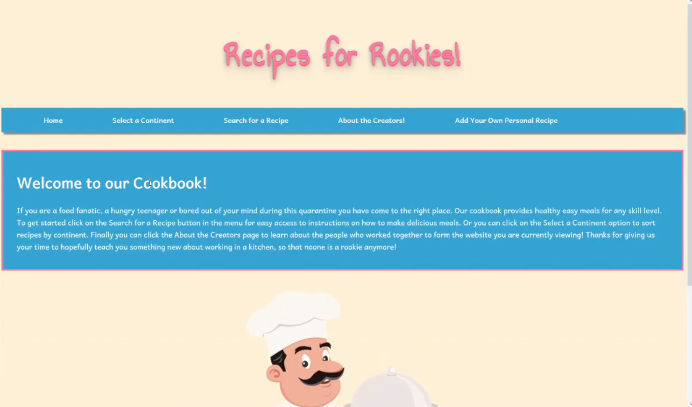
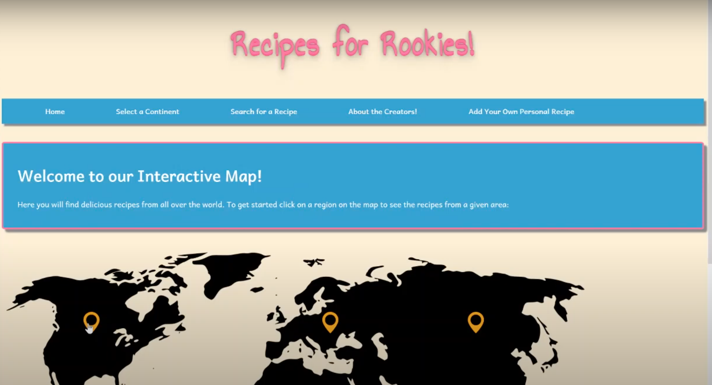

# RecipesForRookies # 

Welcome to Recipes For Rookies!

**Recipes For Rookies**
Recipes For Rookies is a digital cookbook with beginner-friendly recipes from around the world; perfect for new chefs learning how to cook.

This website was built at my very first hackathon ever at MLH RookieHacks built by Lauren Rowe, Ashish Gupta, Nick Boisclair, and Alana Reyes. We didn't have time to learn how to connect a database/storage mechanism so all the recipes are hardcoded html files.

## How It Works

1. Click on a spot on the world map to discover recipes from that region, then choose one and enjoy making a delicious meal.
2. Additionally, we also have a search functionality that you can use to search for a recipes you like.

## Lessons Learned

- Hackathons are fun.
- I need sleep to function.
- Nav-bar means the navigation bar at the top of the screen.
- Organizing files into folders would have been cool and easier to manage.

## Known Bugs

- The add your own recipe feature is not set up.

## Screenshots

